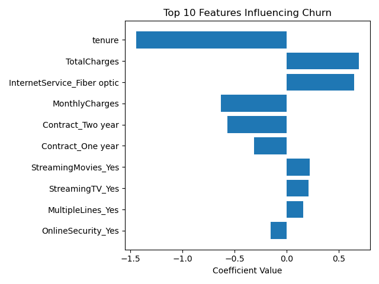

# Customer Churn Prediction (Logistic Regression)

## Overview

This project builds a logistic regression model to predict customer churn using the Telco Customer Churn dataset.

The objective was to identify customers at risk of leaving and determine the key drivers influencing churn behavior.

---

## Business Objective

Identify churn risk factors and evaluate how effectively a baseline classification model can detect at-risk customers.

---

## Tools Used

- Python (pandas, matplotlib)
- scikit-learn (Logistic Regression)
- Jupyter Notebook

---

## Data Preparation

- Converted TotalCharges to numeric and handled missing values
- Encoded categorical variables using one-hot encoding
- Scaled features using StandardScaler
- Performed 80/20 train-test split

---

## Model Performance

- Accuracy: ~79%
- Recall (Churn): 52%
- Precision (Churn): 62%

The model correctly identifies over half of churners while maintaining reasonable precision for targeted intervention strategies.

---

## Key Drivers of Churn

Top factors influencing churn probability:

- **Tenure** (longer tenure reduces churn)
- **Fiber optic service** increases churn risk
- **Higher lifetime spend** associated with increased churn
- **Longer contracts (1-year, 2-year)** significantly reduce churn
- **Online security services** reduce churn likelihood

---

## Feature Importance

---

## Summary

This project demonstrates data cleaning, feature engineering, logistic regression modeling, and business-focused interpretation of predictive analytics results.
